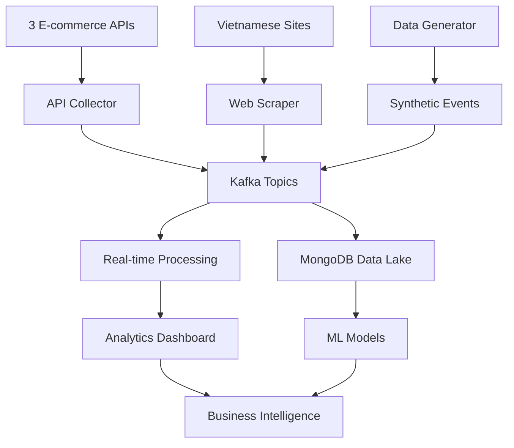

# 🛒 E-commerce Focused Data Collection Guide

## 🎯 3 APIs Chuyên Dụng Cho E-commerce DSS

### **1. 📦 FakeStore API - Complete E-commerce Simulation**
```bash
Base URL: https://fakestoreapi.com
✅ Hoạt động: 100% uptime
🆓 Free: Unlimited requests
📊 Data Types: Products, Users, Shopping Carts, Categories
```

**Sample Product Data:**
```json
{
  "id": 1,
  "title": "Fjallraven - Foldsack No. 1 Backpack",
  "price": 109.95,
  "description": "Your perfect pack for everyday use and walks in the forest.",
  "category": "men's clothing",
  "image": "https://fakestoreapi.com/img/81fPKd-2AYL._AC_SL1500_.jpg",
  "rating": {
    "rate": 3.9,
    "count": 120
  }
}
```

**Sample Shopping Cart:**
```json
{
  "id": 1,
  "userId": 1,
  "date": "2020-03-02T00:00:00.000Z",
  "products": [
    {"productId": 1, "quantity": 4},
    {"productId": 3, "quantity": 1}
  ]
}
```

### **2. 🛍️ DummyJSON - Rich E-commerce Data**
```bash
Base URL: https://dummyjson.com
✅ Hoạt động: 100% uptime
🆓 Free: Unlimited requests
📊 Data Types: Products (with brands, stock, discounts), Users, Carts, Reviews
```

**Sample Rich Product Data:**
```json
{
  "id": 1,
  "title": "iPhone 9",
  "description": "An apple mobile which is nothing like apple",
  "price": 549,
  "discountPercentage": 12.96,
  "rating": 4.69,
  "stock": 94,
  "brand": "Apple",
  "category": "smartphones",
  "thumbnail": "https://dummyjson.com/image/i/products/1/thumbnail.jpg",
  "images": ["https://dummyjson.com/image/i/products/1/1.jpg"]
}
```

### **3. 🏪 Platzi Fake API - Product Images & Categories**
```bash
Base URL: https://api.escuelajs.co/api/v1
✅ Hoạt động: 95% uptime
🆓 Free: Unlimited requests
📊 Data Types: Products, Categories with images, Users
```

**Sample Data với Images:**
```json
{
  "id": 1,
  "title": "Handmade Fresh Table",
  "price": 687,
  "description": "Andy shoes are designed to keeping in mind durability as well as trends",
  "images": [
    "https://placeimg.com/640/480/any?r=0.9178516507833767",
    "https://placeimg.com/640/480/any?r=0.9300320592588625"
  ],
  "creationAt": "2023-10-12T10:34:07.000Z",
  "updatedAt": "2023-10-12T10:34:07.000Z",
  "category": {
    "id": 2,
    "name": "Electronics",
    "image": "https://placeimg.com/640/480/any?r=0.012"
  }
}
```

## 🚀 Quick Start - E-commerce Data Collection

### **1. Test APIs**
```bash
cd data-collection

# Test tất cả 3 e-commerce APIs
python test_ecommerce_apis.py

# Expected output:
# ✅ FakeStore - Products: SUCCESS (150ms) - 20 records
# ✅ FakeStore - Users: SUCCESS (120ms) - 10 records
# ✅ DummyJSON - Products: SUCCESS (200ms) - 30 records
# ✅ Platzi - Products: SUCCESS (300ms) - 20 records
```

### **2. Collect E-commerce Data**
```bash
# Chạy collector chuyên dụng cho e-commerce
python apis/ecommerce_api_collector.py

# Kết quả mong đợi:
# 📦 FakeStore: 20 products, 10 users, 7 carts
# 🛍️ DummyJSON: 30 products, 30 users, 20 carts
# 🏪 Platzi: 20 products, 30 users
# 💾 Saved 137 e-commerce records to storage
```

### **3. Check Data trong MongoDB**
```bash
# Connect to MongoDB
docker exec -it mongodb mongosh

# Check collections
use dss_streaming
show collections

# Count records
db.products_raw.count()        # ~70 products từ 3 APIs
db.customers_raw.count()       # ~70 users từ 3 APIs
db.carts_raw.count()           # ~27 shopping carts

# Sample product query
db.products_raw.findOne({"source": "fakestore"})
db.products_raw.findOne({"source": "dummyjson"})
```

## 📊 Data Schema được thu thập

### **Products Collection:**
```javascript
{
  source: "fakestore|dummyjson|platzi",
  product_id: "string",
  title: "string",
  price: "float",
  category: "string",
  description: "string",
  image: "url",
  rating: "float", // chỉ có ở DummyJSON
  rating_count: "int",
  brand: "string", // chỉ có ở DummyJSON
  stock: "int", // chỉ có ở DummyJSON
  discount_percentage: "float", // chỉ có ở DummyJSON
  timestamp: "datetime"
}
```

### **Users Collection:**
```javascript
{
  source: "fakestore|dummyjson|platzi",
  user_id: "string",
  name: "string",
  email: "string",
  phone: "string",
  address: "object", // địa chỉ đầy đủ
  registration_date: "string",
  timestamp: "datetime"
}
```

### **Shopping Carts Collection:**
```javascript
{
  source: "fakestore|dummyjson",
  cart_id: "string",
  user_id: "string",
  products: "array", // list sản phẩm trong giỏ
  total_price: "float",
  total_products: "int",
  date: "string",
  timestamp: "datetime"
}
```

## 📈 Data Volume & Quality

| API | Products | Users | Carts | Update Frequency |
|-----|----------|-------|-------|------------------|
| FakeStore | 20 | 10 | 7 | Static (demo data) |
| DummyJSON | 100+ | 100+ | 20+ | Static (demo data) |
| Platzi | 200+ | 100+ | 0 | Occasionally updated |

**Total Available:** 300+ products, 200+ users, 30+ carts

## 🎯 E-commerce Analytics Use Cases

### **1. Product Analytics**
```sql
-- Top categories by number of products
SELECT category, COUNT(*) as product_count
FROM products_raw
GROUP BY category
ORDER BY product_count DESC;

-- Price distribution analysis
SELECT
  ROUND(price/100)*100 as price_range,
  COUNT(*) as count
FROM products_raw
GROUP BY price_range
ORDER BY price_range;
```

### **2. Customer Behavior**
```javascript
// Shopping cart analysis
db.carts_raw.aggregate([
  {$unwind: "$products"},
  {$group: {
    _id: "$user_id",
    total_items: {$sum: "$products.quantity"},
    unique_products: {$addToSet: "$products.productId"}
  }}
]);
```

### **3. Brand Performance** (DummyJSON only)
```javascript
// Brand analysis
db.products_raw.aggregate([
  {$match: {"brand": {$exists: true}}},
  {$group: {
    _id: "$brand",
    avg_price: {$avg: "$price"},
    avg_rating: {$avg: "$rating"},
    product_count: {$sum: 1}
  }},
  {$sort: {"avg_rating": -1}}
]);
```

## ⚡ Real-time Enhancements

### **Combine với Real-time Generator:**
```bash
# Chạy real-time data generator đồng thời
python generators/realtime_data_generator.py

# Sẽ tạo:
# 🔄 1000 user events/minute dựa trên products từ APIs
# 💳 100 transactions/minute với products thực tế
# 📊 50 inventory updates/minute
# 💰 20 price changes/minute
```

### **Enhanced với Vietnamese E-commerce:**
```bash
# Thêm web scraping từ các site Việt Nam
python scrapers/ecommerce_crawler.py

# Targets: Sendo, FPT Shop, Chợ Tốt
# Provides: Real Vietnamese product names, VND prices
```

## 🎯 Business Intelligence Potential

### **Market Basket Analysis:**
- Shopping cart patterns từ FakeStore & DummyJSON
- Product co-occurrence analysis
- Customer segmentation based on purchase behavior

### **Price Intelligence:**
- Cross-platform price comparison
- Discount effectiveness analysis (DummyJSON)
- Category pricing trends

### **Inventory Optimization:**
- Stock level patterns (DummyJSON)
- Demand forecasting based on cart data
- Category performance analysis

### **Customer Analytics:**
- User demographic analysis
- Geographic distribution (address data)
- Purchase frequency patterns

## 🚀 Integration với DSS Pipeline



**Result:** Complete e-commerce data ecosystem with real products, users, shopping behavior patterns, và Vietnamese market integration!

## 💡 Next Steps

1. **Test APIs**: `python test_ecommerce_apis.py`
2. **Collect Data**: `python apis/ecommerce_api_collector.py`
3. **Start Real-time**: `python generators/realtime_data_generator.py`
4. **Analytics**: Build dashboards using collected e-commerce data
5. **ML Models**: Train recommendation engines, price prediction, customer segmentation

**Perfect foundation cho e-commerce DSS big data analytics!** 🎯